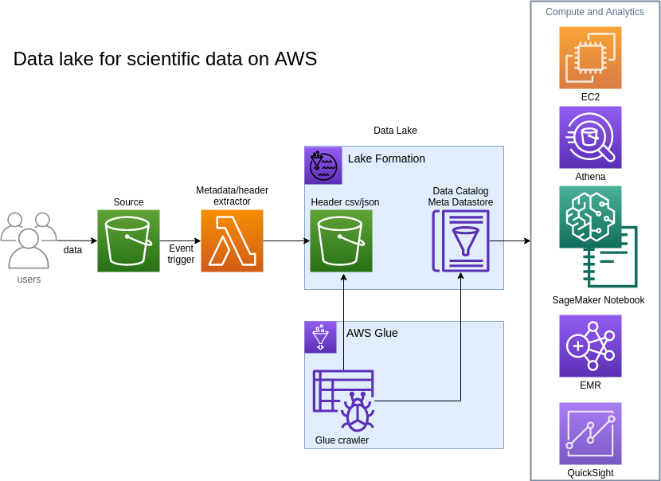

# Welcome to FITS Data Lake project. 

## Introduction 
Flexible Image Transport System (FITS) is the most commonly used file format in astronomy. Each FITS file contains one or more ASCII headers (metadata) and a binary data section as multi-dimensional array or tables. 
Information about the data itself, such as instrument configuration, observation details, image origin, rize and coordinates, are stored in the headers as key value pairs. 

Self-contained metadata format makes it possible for easy transport and sharing. It also provides challenges on the searchability and managibility of the data, especially when you are working on a large amount of data from different satallites or instruments. 

Data lake is a centralized data repository, which has gain popularity in recently years as the size of the data grow exponentially in all industries. Unlike traditional data warehouse where high peformance relational databases ( can be very expensive at large scale ) are used to store data in a central location and with pre-determined schema, data lake takes advantage of existing storage and centralize data schema in a data catalog. For example, to build a data lake on AWS, you can put structured or unstructed data in Amazon Simple Storage Service (Amazon S3) with different schema, automate an ETL crawler to aggregate the schemas into a fully managed data catalog. Then you can run sql querie against the data catalog and process your data. 

Data lake has been used mostly in data analytics so far. In this solution, however, we will apply the concept and practice of building a serverless data lake in AWS cloud for FITS data. This approach can be applied to most of the scientific data, which containes metadata within or with external attachment of metadata files. 


## About CDK
This project is built with AWS Cloud Development Kit (CDK) using Python. AWS CDK is an open source software development framework you can use to build and deploy your cloud infrastrures and application resources using your favorite programming language (as an alternative to using AWS CloudFormation). For more detailed information about AWS CDK, please visit https://aws.amazon.com/cdk/. 

Assume you have installed cdk and aws cli on the computer you are working on. For instructions on how to install AWS CDK and AWS cli, please visit https://docs.aws.amazon.com/cli/latest/userguide/cli-chap-install.html and  https://docs.aws.amazon.com/cdk/latest/guide/getting_started.html

## Build and deploy the FITS Data Lake project

### Project Structure
<pre>
project_folder/
|-- fits_data/                      # sample FITS files
    |-- REAEME.md                   # instruction on how to download the test data from public sources
|-- images/
|-- my_fits_datalake/
    |-- my_fits_datalake_stack.py   # the FitsDatalakeStack code
!-- notebooks/                      # test jupyter notebook
|-- resources/
    |-- fits_header_extractor       # lambda code for extracting FITS header info
|-- app.py                          # CDK app code
|-- cdk.json                        # CDK config
|-- test/
|-- README.md
|-- requirements.txt
|-- setup.py
|-- source.bat 
</pre>

#### Step 1. Create a virtual environment

This project is set up like a standard Python project. To create the virtualenv it assumes that there is a `python3` (or `python` for Windows) executable in your path with access to the `venv`
package. 

To create a virtualenv on MacOS and Linux:

```
$ python3 -m venv .env
```

After the init process completes and the virtualenv is created, you can use the following
step to activate your virtualenv.

```
$ source .env/bin/activate
```

If you are a Windows platform, you would activate the virtualenv like this:

```
% .env\Scripts\activate.bat
```

Once the virtualenv is activated, you can install the required dependencies.

```
$ pip install -r requirements.txt
```
To add additional dependencies, for example other CDK libraries, just add
them to your `setup.py` file and rerun the `pip install -r requirements.txt`
command.

#### Step 2. Modify project parameters in app.py

The `cdk.json` file tells the CDK Toolkit how to execute your app when you run `cdk deploy`.

In app.py, there are three parameters you can customize: 

```
##### Begin customization
# This is the name of the bucket where your source FITS files are stored or will be stored. The bucket must exist already and must be unique. Must be changed
source_bucket_name = "<changeme>"

# This is the name of the database for the data catalog, you can leave it as is 
glue_database_name = "fits_datalake"

# stack id, you can leave as is
stack_id = "my-fits-datalake"
###### End customization
```

#### Step 3. Synthesize and deploy the project
At this point you can now synthesize the CloudFormation template for this code. The result templates can be viewed in cdk.out (auto generated) folder

```
$ cdk synth     # this will synthesize the CloudFormation templates
$ cdk deploy    # this will deploy the tack via CloudFormation
```
Main resources created will be ( not including IAM Roles, policies, lambda layers, permissions etc),

| Resource Type | Name | Alias | 
|---------------|------|-------|
| S3::Bucket | <stack_id>-fitsstorebucket<guid> | <target_bucket_name> |  
| Lambda::Function | <stack_id>-FITSHeaderExtractorHandler\<guid\> | <header_extractor_lambda> |
| Glue::Database | fits_datalake | <glue_database> | <glue_database>
| Glue::Crawler | fitsdatalakecrawler-\<guid\> | <glue_crawler> |

Subsequent execution of `cdk deploy` will create a CloudFormation stack changeset and only update the existing stack.


#### Step 4. Test your deployment
If you want to use some public FITS data, navigate to the 'fits_data" folder, run the following commands to download the data

```bash
wget https://www.spacetelescope.org/static/projects/fits_liberator/datasets/eagle/502nmos.zip
unzip -d hubble_samples 502nmos.zip
rm 502nmos.zip
wget -P fits_samples https://fits.gsfc.nasa.gov/samples/WFPC2u5780205r_c0fx.fits
wget -P fits_samples https://fits.gsfc.nasa.gov/samples/FOCx38i0101t_c0f.fits
wget -P fits_samples https://fits.gsfc.nasa.gov/samples/FOSy19g0309t_c2f.fits
wget -P fits_samples https://fits.gsfc.nasa.gov/samples/HRSz0yd020fm_c2f.fits
wget -P fits_samples https://fits.gsfc.nasa.gov/samples/WFPC2ASSNu5780205bx.fits
wget -P tutorials http://data.astropy.org/tutorials/FITS-images/HorseHead.fits
cd ..
```

Thene copy the content of the folder into your existing S3 bucket (replace `<source_bucket_name>` with your bucket name):


``` 
aws s3 cp --recursive fits_data/ s3://<source_bucket_name>/
```

If you already have FITS files in your <source_bucket_name> bucket, run the following aws cli command
```
aws s3 cp --recursive --metadata {\"touched\":\"true\"} s3://<source_bucket_name>/ s3://<source_bucket_name>/
```
This will "touch" all the existing FITS files in the source bucket.

Create and/or updateing files in the <source_bucket_name> bucket will trigger the header extraction lambda function to create header csv files in the <target_bucket_name>. 


## FITS Datalake Project

### Architecture



Let's walk through what happens when a FITS file is uploaded to the source bucket

- S3PutObject/S3RemoveObject Event triggers the header extractor lambda function <header_extractor_lambda>
- FITS header is extracted and saved into a csv file to the destination bucket <target_bucket_name>
- AWS Glue crawler <glue_crawler> updates the database tables in AWS Glue data catalog <glue_database>


## Appendix

### How to Create a layer for the lambda function

```
$ mkdir resoures_layer
$ mkdir python
$ pip install aws_cdk.aws_lambda aws_cdk.aws_s3
$ pip install astropy --target python
$ zip -r9 resources_layer/astropy.zip python
```
use resources_layer/astropy.zip to create a new layer

```
        layer_astropy = lambda_.LayerVersion(self, 'AstroFitsioLayer', 
            code=lambda_.Code.from_asset("resources_layer/astropy.zip"),
            compatible_runtimes=[lambda_.Runtime.PYTHON_3_7]
        )
       # use an AWS provided layer for numpy
        layer_numpy = lambda_.LayerVersion.from_layer_version_arn(self, "NumpyLayer", "arn:aws:lambda:us-east-1:668099181075:layer:AWSLambda-Python37-SciPy1x:22")
```
Astropy depends on Numpy package, furtunately AWS has a public layer available (arn:aws:lambda:us-east-1:668099181075:layer:AWSLambda-Python37-SciPy1x:22)


## Security

See [CONTRIBUTING](CONTRIBUTING.md#security-issue-notifications) for more information.

## License

This library is licensed under the MIT-0 License. See the LICENSE file.
